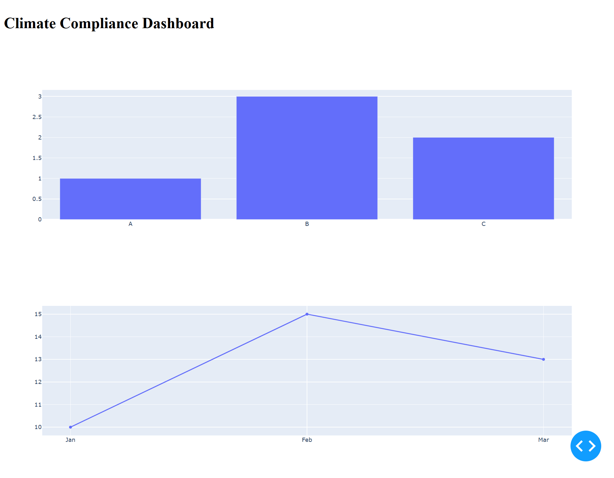

# Climate Compliance Tracker

## Project Overview

The **Climate Compliance Tracker** is an interactive dashboard designed to visualize and analyze carbon emissions, renewable energy usage, and climate policies across various countries. This project empowers stakeholders, researchers, and policymakers to gain insights into how nations are addressing climate change through data-driven approaches.

---

## Sample Output

Here’s a preview of the interactive dashboard:



---

## Tools & Technologies

* **Database:** PostgreSQL
* **Programming Language:** Python
* **Libraries:**

  * Pandas – for data manipulation
  * SQLAlchemy – for database connection
  * Plotly – for interactive data visualization
* **Framework:** Dash – for building the interactive web application

---

## Project Structure

```
climate_compliance_project/
├─ Data Analysis.ipynb       # Jupyter notebook for data exploration and analysis
├─ README.md                 # Project overview, instructions, and documentation
├─ app.py                    # Dash application script for the interactive dashboard
├─ data.sql                  # SQL script to create and populate the PostgreSQL database
└─ asset/                    # Folder containing images and other assets
   └─ output.png             # Sample output screenshot of the dashboard
```
---

## What We Did

### 1. Database Creation

We structured a **PostgreSQL database** with the following tables:

* **Countries:** Stores country information including name, continent, and population.
* **Emissions:** Contains carbon, methane, and nitrous oxide emissions data by year and country.
* **Policies:** Records climate-related policies implemented in each country.
* **Renewables:** Tracks the percentage of renewable energy usage per year by country.

### 2. Data Ingestion

* Data was fetched from the PostgreSQL database into **Pandas DataFrames** using Python and SQLAlchemy for further analysis.

### 3. Data Cleaning

* Conducted **data quality checks** to remove missing or inconsistent values.
* Standardized datasets for consistent and accurate analysis.

### 4. Data Analysis

* Computed **total carbon emissions** and **average renewable energy percentages** by country.
* Identified trends and patterns in emissions and renewable adoption.

### 5. Data Visualization

* Created engaging visualizations using **Plotly**, including:

  * Bar charts for emissions comparisons
  * Line graphs to track renewable energy trends over time

### 6. Interactive Dashboard

* Built a **Dash application** allowing users to:

  * Filter data by country
  * Explore emissions and renewable energy usage
  * View specific climate policy details

---

## Conclusion

The **Climate Compliance Tracker** demonstrates the power of data analytics in understanding global climate actions. Through interactive visualizations, users can easily interpret complex datasets, monitor trends, and evaluate climate policies and renewable energy adoption across countries.

---

## Recommendations & Future Work

1. **Expand Dataset:** Include more countries and detailed emission types for a comprehensive analysis.
2. **Enhance Visualizations:** Add advanced interactive features like time series analysis and predictive modeling.
3. **User Feedback:** Incorporate a feedback mechanism to understand user experience and areas for improvement.
4. **API Integration:** Pull real-time emissions and policy updates for up-to-date insights.
5. **User Authentication:** Allow personalized dashboards for individual users.
6. **Mobile-Friendly Version:** Develop a responsive version for accessibility on mobile devices.

---

## How to Run

Follow these steps to run the **Climate Compliance Tracker** locally:

1. **Clone the Repository**

```bash
git clone https://github.com/your-username/climate_compliance_project.git
cd climate_compliance_project
```

2. **Install Dependencies**

```bash
pip install dash==2.9.3
pip install pandas sqlalchemy plotly
```

3. **Run the Dashboard**

```bash
python app.py
```

4. **Open in Browser**
   Visit the following URL in your browser:

```
http://127.0.0.1:8050/
```

---
